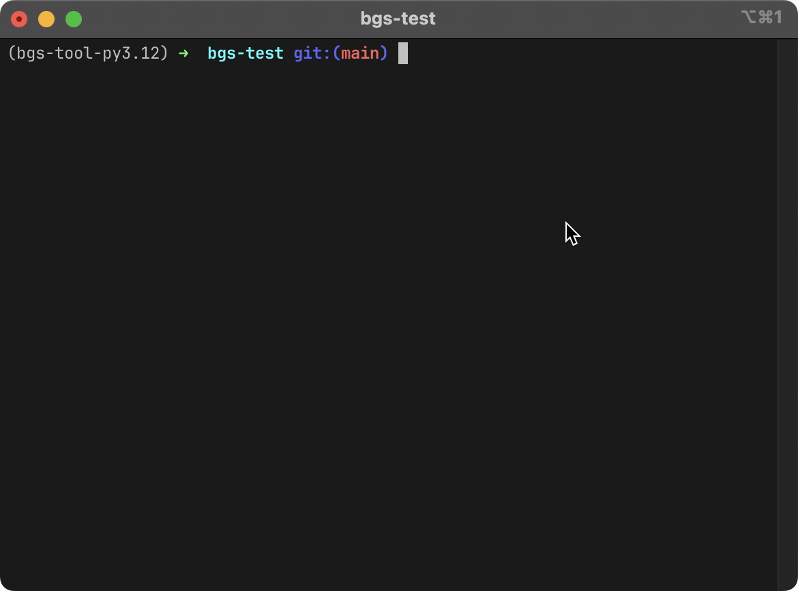
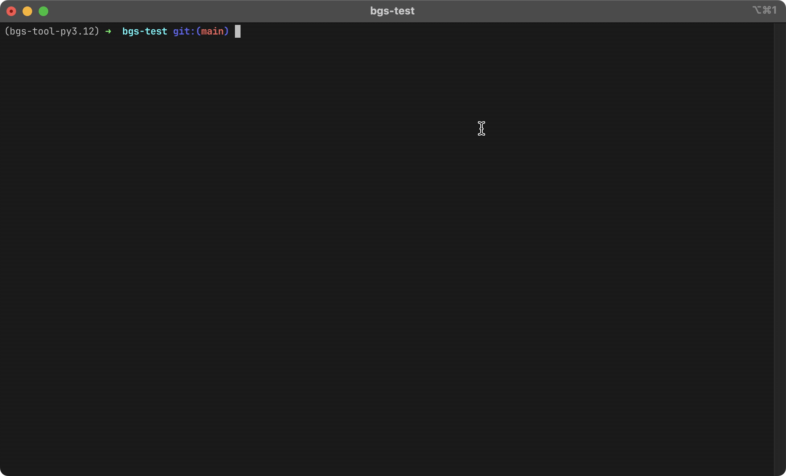
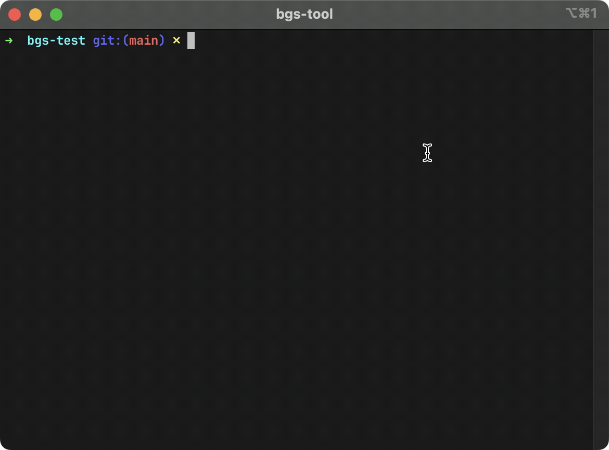
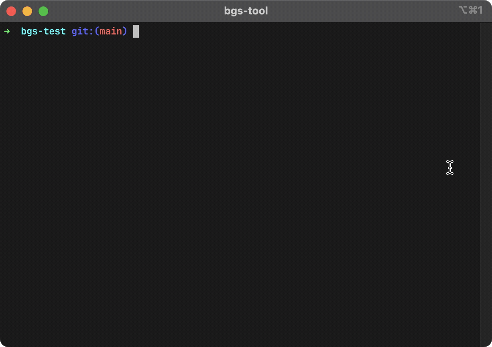
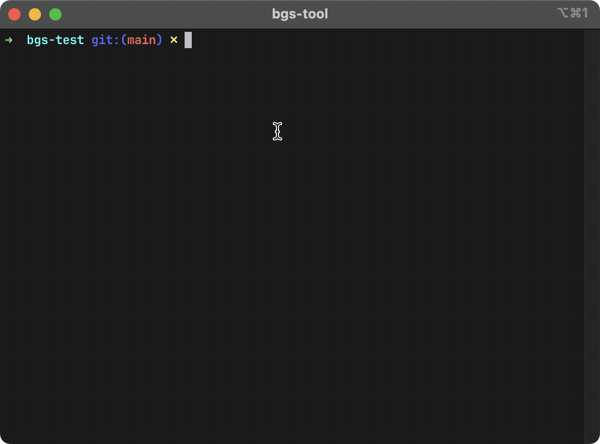

<div align="center">

# **bgs-tool**

</div>

---

<div align="center">

[](https://github.com/LoveDuckie/bgs-test/actions/workflows/build_python.yml)

</div>

## Overview

`bgs-tool` is the application satisfying the test requirements for BGS. Below, you'll find details on how to run the application, its structure, and the design choices made during development.

---

## Usage

> **Note:** Ensure you follow the installation instructions before using the tool.

<div align="center">



</div>

### Example: All parameters

```bash
#!/usr/bin/env bash
bgs-tool --create-test-files --min-file-size-bytes 1048576 --max-file-size-bytes 1048576 --max-group-size-megabytes 10 --method compact --min-files 20 --max-files 20
```

### Example: Create and Use Test Data

#### Defaults

- **Minimum Files:** 5
- **Maximum Files:** 15
- **Minimum File Size Bytes:** 
- **Maximum File Size Bytes:**

**Using default values**

```bash
#!/bin/bash
bgs-tool --create-test-files --max-group-size-megabytes 25 --method compact --validate
```

<div align="center">



</div>

**Overriding file generation parameters**

```bash
#!/bin/bash
bgs-tool --create-test-files --min-files 5 --max-files 15 --max-group-size-megabytes 25 --method default --validate
```

### Example: Use Existing Source Files

```bash
#!/bin/bash
bgs-tool --source-dir <Path Goes Here> --max-group-size-megabytes 25 --method default --validate
```

## Installation

This project is structured as a `pip`-installable package, suitable for local or editable installation. Editable installations symbolically link the package to `site-packages` for the active Python version.

### Installation Methods

#### Using `pip`

`pip` is the package management tool for Python. This project can be installed as a package.

<div align="center">



</div>

#### Using `pip` with `virtualenv`

`pip` can be paired with `virtualenv` to isolate project dependencies in a virtualized environment.

<div align="center">



</div>

#### Using `pipx`

`pipx` installs Python tools in isolated virtual environments, avoiding pollution of the global `site-packages`.

<div align="center">



</div>

---

## Unit Tests

Unit tests were defined as part of this test sample. You can run them using the following command with `poetry`.

```bash
#!/usr/bin/env bash
poetry run coverage run -m unittest discover .
```

### Example Output

```plaintext
2024-12-06 12:15:50,736 - DEBUG - get_file_attributes executed in 0.000001 seconds
.2024-12-06 12:15:50,755 - DEBUG - get_file_attributes executed in 0.000002 seconds
.2024-12-06 12:15:50,758 - DEBUG - group_files_compact executed in 0.000676 seconds
.2024-12-06 12:15:50,759 - DEBUG - group_files executed in 0.000250 seconds
...2024-12-06 12:15:50,766 - DEBUG - group_files_compact executed in 0.000835 seconds
...2024-12-06 12:15:50,777 - DEBUG - save_groups executed in 0.003467 seconds
...
----------------------------------------------------------------------
Ran 12 tests in 0.050s

OK
```

---

## Requirements

- **Tested OS:** macOS Sonoma

### Tools

This project uses the following tools:

- **`poetry`:** Manages project dependencies and metadata.  
  ⚠️ **No external dependencies were added—only core Python packages are used.**
- **`pyenv`:** Manages multiple Python versions on the same system.  
- **`pipx`:** Ensures isolated installations of packaged projects.  
- **`virtualenv`:** Creates isolated dependency environments.

### Pipelines

The project uses **GitHub Actions** for continuous integration, covering linting, testing, packaging, and publishing. The workflow file is located at `.github/workflows/build_python.yml`.

Pipeline steps include:

1. **Dependency Installation**
2. **Linting and Testing**:
   - **Linting:** Runs `pylint` on project files.
   - **Testing:** Executes `unittest` test cases with `coverage` for accuracy.
3. **Building**:
   - Packages the tool for distribution.

---

## Design Considerations

### Code Standards

- **PEP 8 Compliance:** The project adheres to Python's style guide, enforced via `pylint` with a ruleset specified in `.pylintrc`.
- **PEP 517, 518, 621 Compliance:** Implements standards for project metadata and dependency management using `poetry`.

### Performance

- **Compact Packing Algorithm:** Optimizes file grouping for compactness. I've also included the initial implementation of the algorithm to illustrate the progression.
- **Efficient Directory Listing:** Uses `DirEntry` objects and `yield` to process directories incrementally, reducing memory overhead for large directories.

---

## Additional Features

### Bonus Contributions

In addition to meeting the core requirements, the following features were added:

- **GitHub Actions CI/CD:** Automated linting, testing, and packaging with every commit.
- **Project Management with `poetry`:** Includes scripts for command-line invocation (`bgs-tool`).
- **Semantic Versioning:** Implemented using `poetry-bumpversion` for adherence to [Semantic Versioning](https://semver.org/).
- **Helper Scripts:** Consistent configuration and output for developers working on the project.

---

<div align="center">

**⚠️ Note:** All enhancements are strictly within the scope of the requirements.

</div>
